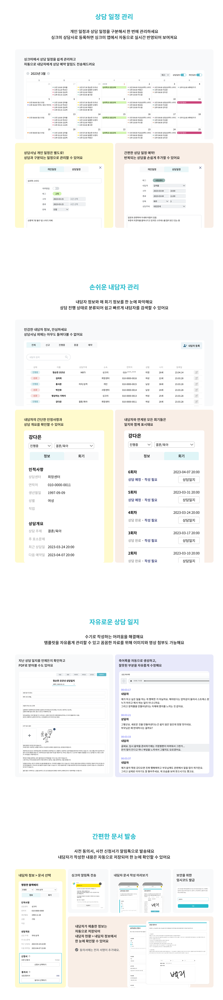

# 모두의 심리상담, 싱크미

 

  

> 싱크미는 심리상담사분들의 업무를 도와드리는 업무 툴 입니다.

 

|모두의 심리상담, 싱크미|
| :------: |
|[랜딩 페이지](https://thinkme.co.kr)|
|[서비스 페이지](https://app.thinkme.co.kr)|
|[안드로이드](https://play.google.com/store/search?q=%EC%8B%B1%ED%81%AC%EB%AF%B8&c=apps&hl=ko)|
|[IOS](https://apps.apple.com/kr/app/%EC%8B%B1%ED%81%AC%EB%AF%B8-%EB%AA%A8%EB%91%90%EC%9D%98-%EC%8B%AC%EB%A6%AC%EC%83%81%EB%8B%B4/id1658472436)|

  

## 목차
1. [개요](#개요)
2. [서비스 소개](#서비스-소개)
3. [프로젝트 설계](#프로젝트-설계)
4. [개발 환경 및 기술 스택](#개발-환경-및-기술-스택)
5. [팀원 소개](#팀원-소개)

 

## [개요](#목차)

**모두의 심리상담, 싱크미**

모두의 심리상담, 싱크미는 불편한 업무 프로세스를 디지털 트랜스포메이션 하여 원활한 업무를 할 수 있게 도와주는 업무 툴 입니다. 기존 서비스들과 다른 점은 상담센테를 기준으로 개발된 것이 아닌 개인 상담사가 중심이되어 다양한 그룹(예 상담센터)에 가입해 업무 협업을 진행하는 방식으로 개발이 진행되었습니다. 이로인해 고객들의 데이터들을 한 곳에서 관리할 수 있다는 장점이 있습니다.

 

> **개발 기간** : `2022-03-31 ~ 2023-12-28`

 

### 주요 기능

1. 일정관리
    - 개인 일정과 업무 일정을 한 눈에 확인할 수 있게 하여 편리하게 일정 관리
    - 드래그 & 드랍으로 손쉽게 일정 수정
    - 공개하고 싶은 일정만 공개
      
2. 내담자 온라인 상담
    - 내담자는 어플로 상담사는 업무 툴을 활용하여 채팅, 음성, 화상 상담을 진행
    - 상담 전 다양한 심리검사를 진행하고 이를 음성 상담으로 진행
    - 상담 중인 내담자의 상담일지가 보여져 빠르게 상담일지 작성
      
3. 심리상담센터 그룹에 가입
    - 여러 장소에서 상담을 진행하는 상담사들은 여러 그룹(센터)에 가입 한 뒤 업무를 하는 날짜의 일정만 공개
    - 그룹(센터)의 일정, 인원 들을 따로 관리
      
4. 알림 기능
     - 온라인 상담 신청이 오게 되면 알림 톡 발송
     - 등록한 상담 하루전, 1시간 전 ,10분 전 알림 톡 발송

 

## [서비스 소개](#목차)

## [프로젝트 설계](#목차)

### 시스템 아키텍쳐

 

## [개발 환경 및 기술 스택](#목차)

|  개발 환경  | 기술 스택 |
|:-------:|:---------------------------------------------------------------------------------------------------------------------------------------------------------------------------------------------------------------------------------------------------------------------------------------------------------------------------------------------------------------------------------------------------------------------------------------------------------------------------------------------------------------------------------------------------------------------------------------------------------------------------------------------------------------------------------------------------------------------------------------------------------------------------------------------------------------------------------------------------------------------------------------------------------------------------------------------|
| **Frontend** |         |
| **Backend** |          |
|   **DB**    |     |
|   **Infra**   |     |
|**Monitoring**|  
|   **Management Tool**   |       |
|**App**||

 
 

## [팀원 소개](#목차)

<table align="center">
  <tr>
    <th style="text-align: center;"><a href="https://github.com/hongsam100">김민철</a></th>
    <th style="text-align: center;"><a href="https://github.com/baebini11">배원빈</a></th>
    <th style="text-align: center;"><a href="https://github.com/maison01006">오승진</a></th>
  </tr>
  <tr>
    <td style="text-align: center;"></td>
    <td style="text-align: center;"></td>
    <td style="text-align: center;"></td>
  </tr>
  <tr>
    <td style="text-align: center;"><b>Frontend</b></td>
    <td style="text-align: center;"><b>Frontend</b></td>
    <td style="text-align: center;"><b>Infra</b></td>
  </tr>
</table>

<table align="center">
  <tr>
    <th style="text-align: center;"><a href="https://github.com/BTY-97">방태연</a></th>
    <th style="text-align: center;"><a href="https://github.com/jmxx219">손지민</a></th>
    <th style="text-align: center;"><a href="https://github.com/s2hoon">조수훈</a></th>
  </tr>
  <tr>
    <td style="text-align: center;"></td>
    <td style="text-align: center;"></td>
    <td style="text-align: center;"></td>
  </tr>
  <tr>
    <td style="text-align: center;"><b>Backend</b></td>
    <td style="text-align: center;"><b>Backend</b></td>
    <td style="text-align: center;"><b>Backend</b></td>
  </tr>
</table>
